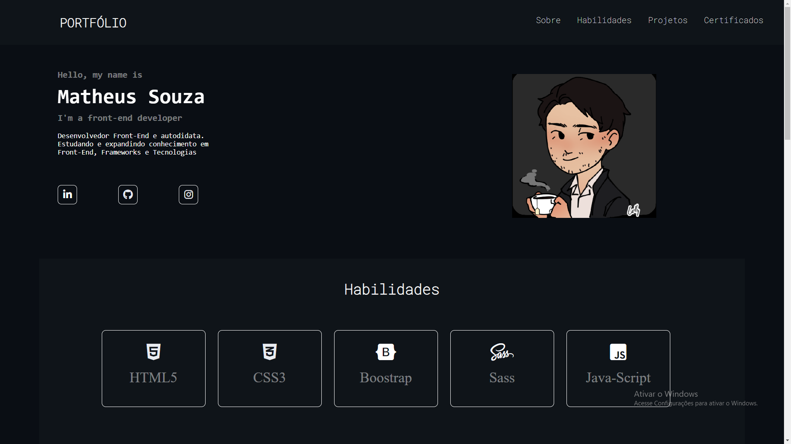

# <a align="center" href="http://mth-dev.is-best.net/"> <h1> Portfólio </h1>

  

#  📝 Descrição do projeto

  Site pessoal totalmente responsivo criado com o propósito de informar minhas certificações e habilidades. Possui minhas informações de contato, e uma breve divulgação de projetos pessoais. 

## 🚀 Tecnologias

Esse projeto está sendo desenvolvido com as seguintes tecnologias:

- HTML5
- CSS3
- SASS
- Java-Script

Como Instalar o Sass
O Sass é um pré-processador CSS que facilita a escrita e a manutenção de estilos em seus projetos web. Para começar a usá-lo, siga as etapas abaixo:

1. Verifique se você possui o Node.js instalado
O Sass requer o Node.js para funcionar. Verifique se você já tem o Node.js instalado em seu sistema executando o seguinte comando no terminal:

shell
Copy code
node -v
Se você não tiver o Node.js instalado, você pode baixá-lo e instalá-lo a partir do site oficial do Node.js: https://nodejs.org/.

2. Instale o Sass globalmente
Após ter o Node.js instalado, você pode instalar o Sass globalmente em seu sistema usando o npm (Node Package Manager). Execute o seguinte comando no terminal:

shell
Copy code
npm install -g sass
Isso instalará o Sass globalmente em seu sistema, permitindo que você o utilize em qualquer projeto.

3. Verifique a instalação do Sass
Para verificar se o Sass foi instalado corretamente, execute o seguinte comando no terminal:

shell
Copy code
sass --version
Você deverá ver a versão do Sass sendo exibida, o que indica que a instalação foi bem-sucedida.

Agora você está pronto para começar a usar o Sass em seus projetos para melhorar a eficiência na escrita de estilos CSS.

Lembre-se de que essas instruções assumem que você já possui o Node.js instalado. Certifique-se de seguir as instruções do site oficial do Node.js para instalá-lo em seu sistema, se necessário.

Nota: Se você estiver usando um gerenciador de pacotes como o Yarn em vez do npm, você pode substituir npm por yarn nas etapas acima.

Isso deve ser suficiente para que os usuários do seu repositório GitHub saibam como instalar o Sass em seus sistemas. Certifique-se de manter este arquivo readme.md atualizado conforme necessário
